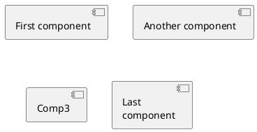

## Introduction

**Istio** is a service mesh that runs on top of Kubernetes. It offers a lot of handy features to work with microservices.
for more information you can check the [official Istio page](https://istio.io/latest/) out.

A popular choice to run a local kubernetes cluster is Kind. According to the 
[official kind page](https://kind.sigs.k8s.io/)

>kind is a tool for running local Kubernetes clusters using Docker container "nodes".
>kind was primarily designed for testing Kubernetes itself, but may be used for local development or CI.

This two tools works nicely once set up, however it is a little tricky to set up a working environment.

Kind installation is really straight forward, you first install docker, and then you can just follow the quick start guide.
I suggest [installing it with a package manager](https://kind.sigs.k8s.io/docs/user/quick-start/#installing-with-a-package-manager).

## Create the cluster

Kind allows you to specify a few options when you create the cluster, you can define the number of nodes, their subnets,
th ports exposed, the kubernetes version... find [here](https://kind.sigs.k8s.io/docs/user/configuration/#clusterwide-options) 
a complete list of them. 

**extraPortMappings**

For a local testing environment you usually can stick to the defaults, the only important setting you usually want to define
is the `extraPortMappings`. Those are ports listening in the host machine that are forwarded to kind nodes.  

A common use case for this setting is expose a database service or your event broker to be accessed from outside the cluster.
Another use case for this is to set up an Ingress Controller to route the http traffic from your host machine to the cluster, 
this is covered by [Ingress](https://kind.sigs.k8s.io/docs/user/ingress).

In case of Istio, it provides its own ingress gateway as a [Service](https://kubernetes.io/docs/concepts/services-networking/service/). 
This service can be set up as `type=NodePort` and assign to a node port in the range [30000-32768].

Let's assume we want to expose `http` traffic in the port `80` and `tls` traffic in the port `433` of the host machine, 
we can use the node ports `30080` and `30433`

To define such a cluster, let's name it "istio-playground", the command would be as follows.

```shell
cat <<EOF | kind create cluster --name istio-playground --wait 5m --config=-
kind: Cluster
apiVersion: kind.x-k8s.io/v1alpha4
nodes:
- role: control-plane
  extraPortMappings:
  - containerPort: 30080
    hostPort: 80
    listenAddress: "0.0.0.0" # Optional, defaults to "0.0.0.0"
    protocol: TCP
  - containerPort: 30443
    hostPort: 443
    listenAddress: "0.0.0.0" # Optional, defaults to "0.0.0.0"
    protocol: TCP
EOF
```

Expected result:


Verify the cluster

````shell
kind get clusters
kubectl config use-context kind-istio-playground
kubectl cluster-info
````

## Gateway deployment topologies

There are several topologies you can choose to deploy the Istio ingress gateway. You can basically share a single centralized
gateway (Shared Gateway) or configure a dedicated gateway per application (Dedicated application gateway). You can find 
more information [here](https://istio.io/latest/docs/setup/additional-setup/gateway/#gateway-deployment-topologies).

For the sake of simplicity we'll choose the "Shared gateway". Let's imagine we'll deploy a workload 
called `demo-app` to demonstrate the setup works fine.


For the Istio installation the following two namespaces are needed:
* `istio-system`: Is the namespace where Istio components are deployed.
* `istio-ingress`: Is where the Istio ingress gateway is deployed.
* `demo-app`: Is where the application "demo-app" is deployed.


## Install Istio

There are several options to install Istio.
* Istio operator: A kubernetes operator
* Istioctl
* [Helm Chart](https://helm.sh/)




